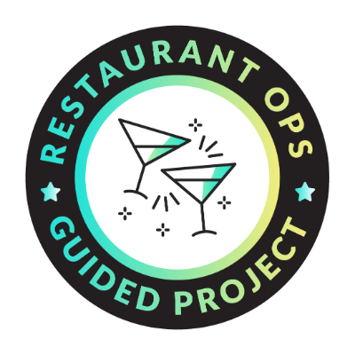

# Restaurant-Sales-SQL-Project          

## Overview

This project was part of a guided exercise from Maven Analytics, where I worked with an imaginary restaurant sales dataset. The exercise provided the dataset and database schema, and I focused on solving business-related questions by writing SQL queries.
 

The project helped me practice:
1. **Data Analysis**: Writing SQL queries to gain insights into menu performance, order trends, and customer preferences.
2. **Problem Solving**: Answering real-world questions through advanced SQL techniques like joins, aggregations, and subqueries.

By completing this project, I gained hands-on experience with SQL and strengthened my ability to analyze data effectively.

## Database Schema

### Tables

1. **menu_items**
   - Contains details about menu items, including their name, category, and price.
   - **Columns**:
     - `menu_item_id` (Primary Key): Unique identifier for each menu item.
     - `item_name`: Name of the menu item.
     - `category`: Type of cuisine or dish.
     - `price`: Cost of the menu item.

2. **order_details**
   - Contains details about customer orders, including items ordered and their timestamps.
   - **Columns**:
     - `order_details_id` (Primary Key): Unique identifier for each order detail.
     - `order_id`: Identifier for a specific order.
     - `order_date`: Date of the order.
     - `order_time`: Time of the order.
     - `item_id`: Identifier for the ordered menu item (Foreign Key linked to `menu_items.menu_item_id`).

## Skills Demonstrated

- **Database Design**: I worked on creating and populating tables with structured data.
- **Data Manipulation**: I wrote and executed SQL queries to extract meaningful insights from the data.
- **Joins and Aggregations**: I combined data from multiple tables and used aggregation techniques to analyze trends.
- **Advanced Querying**: I applied techniques like subqueries, filters, and grouping to answer complex questions.

## Questions Answered

### Menu Analysis
- How many items are on the menu?
- What are the least and most expensive items on the menu?
- How many Italian dishes are on the menu? What are the least and most expensive Italian dishes?
- How many dishes are in each category?
- What is the average price of dishes in each category?

### Order Trends
- What is the date range of the orders in the dataset?
- How many orders and items were made within this date range?
- Which orders had the most number of items?
- How many orders had more than 12 items?

### Combined Analysis (Menu + Orders)
- What were the least and most ordered items? What categories were they in?
- What were the top 5 orders that spent the most money?
- What specific items were purchased in the highest spending order?
- Which categories were most popular in the top 5 highest spending orders?

